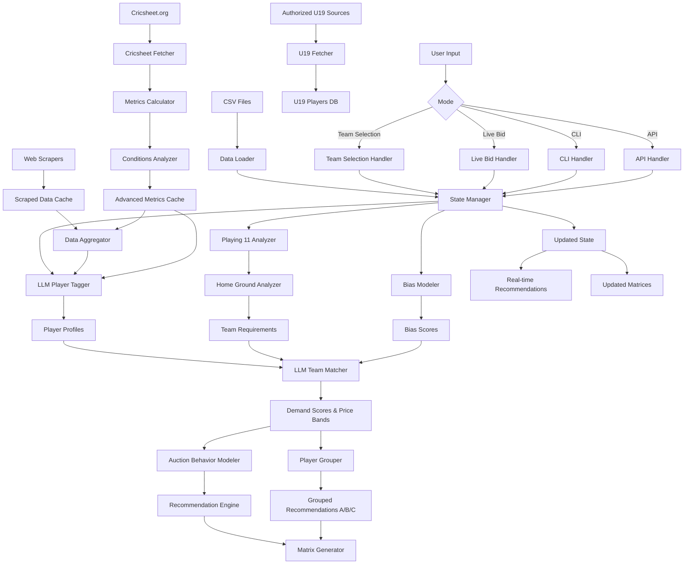

# IPL Auction Strategist System - Implementation Plan (Updated)

## System Architecture

The system will be built in Python with **Google Gemini LLM** integration and **cricsheet.org** data for advanced metrics:

1. **Data Layer**: Parse CSV data (Supply, RetainedPlayers, PurseBalance) + fetch U19 players from authorized websites
2. **Advanced Metrics Engine**: Compute efscore, winp, raa phase-wise from cricsheet.org ball-by-ball data
3. **Match Conditions Tracker**: Track conditions/wickets when players performed well
4. **LLM-Powered Player Analysis**: Gemini-based tagging with advanced metrics integration
5. **Bias Modeling**: Model team bias patterns (e.g., Sam Curran effect)
6. **Playing 11 Analyzer**: Evaluate retained squads and identify gaps
7. **LLM-Powered Team Matcher**: Gemini reasoning for player-team demand matching
8. **Auction Behavior Model**: Predict bidding patterns and likely prices
9. **Home Ground Analyzer**: Consider venue-specific requirements
10. **State Management**: Real-time updates when players are sold
11. **Dual Mode Interface**: Team selection mode (A/B/C groups) + Live bid-by-bid mode
12. **Output Generator**: Team-wise supply & demand matrices, grouped player recommendations

## Implementation Steps

### Phase 1: Data Infrastructure & Gemini Integration

**1.1 Create Enhanced Data Models** (`models/`)

- `Player` class with comprehensive structure:
                                                                                                                                                                                                                                                                - PrimaryRole: Batter/Bowler/BatAR/BowlAR/Spinner/Pacer
                                                                                                                                                                                                                                                                - BattingRole: Opener/MiddleOrder/Finisher (LH/RH) (Indian/Foreigner)
                                                                                                                                                                                                                                                                - BowlingRole: Pacer/WristSpinner/FingerSpinner/LeftArmSpinner/LegSpin/OffSpin/MysterySpinner
                                                                                                                                                                                                                                                                - Speciality: WKBat, PPBowler, MOBowler, DeathBowler
                                                                                                                                                                                                                                                                - BatUtilization: Floater, Anchor, PlaysSpinWell, PlaysPaceWell, SlowAggressor, etc.
                                                                                                                                                                                                                                                                - BowlUtilization: CanBowl4Overs, CanBowl2Overs, etc.
                                                                                                                                                                                                                                                                - InternationalLeagues: List of (league, team, year) tuples
                                                                                                                                                                                                                                                                - IPLExperience: List of (year, team) tuples
                                                                                                                                                                                                                                                                - Scouting: List of teams that called for trials
                                                                                                                                                                                                                                                                - SMATPerformance: Outstanding knocks/spells (match-wise/phase-wise)
                                                                                                                                                                                                                                                                - Quality: A/B Category
                                                                                                                                                                                                                                                                - **AdvancedMetrics**: Phase-wise efscore, winp, raa (Powerplay, Middle Overs, Death)
                                                                                                                                                                                                                                                                - **MatchConditions**: List of (match_id, conditions, wickets_fallen, performance) tuples
                                                                                                                                                                                                                                                                - **PerformanceByConditions**: Dictionary tracking performance in different match situations
- `Team` class: Store team data with home ground conditions
- `AuctionState` class: Track current auction state
- `U19Player` class: Store U19 players from all countries (fetched from authorized sources)
- `MatchConditions` class: Track pitch conditions, weather, wickets fallen, match context

**1.2 CSV Parser** (`core/data_loader.py`)

- Parse `Data/Supply.csv` → List of Player objects
- Parse `Data/RetainedPlayers.csv` → Update Team objects with retained players
- Parse `Data/PurseBalance.csv` → Initialize team purses and slots
- **Remove U19 CSV parsing** - U19 players will be fetched from authorized websites
- Handle data validation and error checking

**1.3 Gemini API Integration** (`llm/gemini_client.py`)

- Set up Google Gemini API client
- Configuration for API keys and model selection
- Rate limiting and error handling
- Caching mechanism for LLM responses to reduce API calls

**1.4 State Manager** (`core/state_manager.py`)

- Maintain in-memory state of auction (available players, sold players, team purses)
- Methods: `add_sold_player()`, `update_team_purse()`, `remove_from_supply()`
- Export/import state to JSON for persistence
- Real-time state updates without file re-reading
- Support for live bid-by-bid mode with instant state updates

### Phase 2: Cricsheet.org Integration & Advanced Metrics

**2.1 Cricsheet.org Data Fetcher** (`scrapers/cricsheet_fetcher.py`)

- Download ball-by-ball data from https://cricsheet.org/matches/
- Support for IPL, SMAT, BBL, SA20, CPL, and other T20 leagues
- Parse JSON match data (YAML format conversion if needed)
- Handle data structure challenges (nested innings, deliveries, etc.)
- Cache downloaded match data locally
- Match player names across different data sources

**2.2 Advanced Metrics Calculator** (`core/metrics_calculator.py`)

- Compute **efscore** (expected runs vs actual runs) phase-wise:
                                                                                                                                                                                                                                                                - Powerplay (overs 1-6)
                                                                                                                                                                                                                                                                - Middle Overs (overs 7-15)
                                                                                                                                                                                                                                                                - Death Overs (overs 16-20)
- Compute **winp** (win probability added) phase-wise
- Compute **raa** (runs above average) phase-wise
- Calculate metrics for all players in supply
- Store phase-wise metrics in Player objects
- Handle edge cases (not outs, incomplete innings, etc.)

**2.3 Match Conditions Analyzer** (`core/conditions_analyzer.py`)

- Extract match conditions from cricsheet data:
                                                                                                                                                                                                                                                                - Pitch conditions (if available in metadata)
                                                                                                                                                                                                                                                                - Weather conditions
                                                                                                                                                                                                                                                                - Wickets fallen at player's entry
                                                                                                                                                                                                                                                                - Match situation (score, required rate, etc.)
- Track player performance by conditions:
                                                                                                                                                                                                                                                                - Performance when wickets down (0-2, 3-5, 6+)
                                                                                                                                                                                                                                                                - Performance in different match situations
                                                                                                                                                                                                                                                                - Balanced performance across conditions
- Store conditions-performance mapping in Player objects
- Identify players who perform well in balanced/diverse conditions

### Phase 3: Web Scraping & U19 Data Collection

**3.1 Web Scraper** (`scrapers/web_scraper.py`)

- Scrape IPL stats from:
                                                                                                                                                                                                                                                                - Official IPL website (https://www.iplt20.com/)
                                                                                                                                                                                                                                                                - ESPNcricinfo IPL series pages (2023, 2024, 2025)
                                                                                                                                                                                                                                                                - Cricbuzz IPL series pages
- Scrape domestic T20 stats:
                                                                                                                                                                                                                                                                - Syed Mushtaq Ali Trophy (SMAT) 2025-26
- Scrape international T20 league stats:
                                                                                                                                                                                                                                                                - BBL 2024-25, 2025-26
                                                                                                                                                                                                                                                                - SA20 2024-25
                                                                                                                                                                                                                                                                - CPL, other leagues
- Scrape whiteball analytics data for IPL
- Store scraped data in structured format (JSON/CSV)

**3.2 U19 Players Fetcher** (`scrapers/u19_fetcher.py`)

- **Fetch U19 players from authorized website sources** (not CSV)
- Sources:
                                                                                                                                                                                                                                                                - ICC U19 World Cup official website
                                                                                                                                                                                                                                                                - ESPNcricinfo U19 sections
                                                                                                                                                                                                                                                                - Official cricket board websites (BCCI, CA, ECB, etc.)
- **Fetch U19 players from ALL countries** (not just India)
- Parse and store U19 player data with country, tournament, performance
- Link U19 players to main player database if they appear in supply
- Update U19 player profiles with recent performances

**3.3 Data Aggregator** (`scrapers/data_aggregator.py`)

- Aggregate player stats from multiple sources
- Integrate cricsheet metrics with scraped stats
- Phase-wise performance data (Powerplay, Middle Overs, Death)
- Recent form analysis (last 10-15 matches)
- Venue-specific performance data
- Combine match conditions data with performance metrics

### Phase 4: Bias Modeling

**4.1 Team Bias Modeler** (`core/bias_modeler.py`)

- Model team bias patterns based on historical data:
                                                                                                                                                                                                                                                                - **Sam Curran Effect**: Track when players performed exceptionally well against a team
                                                                                                                                                                                                                                                                - Example: Sam Curran picked top 3 CSK batters while playing for KXIP → CSK picked him next auction
- Identify bias triggers:
                                                                                                                                                                                                                                                                - Exceptional performance against specific team
                                                                                                                                                                                                                                                                - Key wicket-taking spells against team's star players
                                                                                                                                                                                                                                                                - Match-winning performances in crucial games
- Calculate bias scores:
                                                                                                                                                                                                                                                                - Performance against team (runs scored, wickets taken)
                                                                                                                                                                                                                                                                - Impact on team's key players
                                                                                                                                                                                                                                                                - Match context (playoffs, crucial matches)
- Store bias relationships: (player, target_team, bias_score, reason)

**4.2 Bias Integration** (`core/bias_integrator.py`)

- Integrate bias scores into demand scoring:
                                                                                                                                                                                                                                                                - Add bias boost to demand score (separate factor)
                                                                                                                                                                                                                                                                - Weight bias based on recency and impact
- Include bias information in LLM prompts:
                                                                                                                                                                                                                                                                - Inform LLM about historical performance against team
                                                                                                                                                                                                                                                                - Include bias context in team matching reasoning
- Update bias scores when new matches occur

### Phase 5: LLM-Powered Player Tagging

**5.1 LLM Player Tagger** (`llm/player_tagger.py`)

- Use Gemini LLM to analyze each player with advanced metrics
- Prompt structure for Gemini:
  ```
  Analyze player: [Player Name]
  Data sources: [IPL stats, SMAT stats, BBL stats, cricsheet metrics]
  Advanced Metrics:
  - efscore (PP/MO/Death): [values]
  - winp (PP/MO/Death): [values]
  - raa (PP/MO/Death): [values]
  Match Conditions Performance: [conditions/wickets analysis]
  
  Assign:
  1. PrimaryRole
  2. BattingRole (with hand and nationality)
  3. BowlingRole
  4. Speciality
  5. BatUtilization tags
  6. BowlUtilization tags
  7. InternationalLeagues (league, team, year)
  8. IPLExperience (year, team)
  9. Scouting information
  10. SMATPerformance (for Indian players)
  11. Quality (A/B) based on stats, phase-wise performance, Playing 11 usefulness, recent form, advanced metrics
  12. Conditions adaptability (how well-balanced across conditions)
  ```

- Cache LLM responses to avoid redundant API calls
- Batch processing for multiple players

**5.2 Player Profile Generator** (`core/player_profile.py`)

- Generate comprehensive player profile from LLM tags + advanced metrics
- Include phase-wise efscore, winp, raa in profile
- Include match conditions performance analysis
- Store profiles in database/cache for quick access
- Update profiles when new data is available

### Phase 6: Team Analysis & Gap Identification

**6.1 Playing 11 Analyzer** (`core/playing11_analyzer.py`)

- For each team, analyze retained players
- Build best possible playing 11 from retentions
- Identify gaps in playing 11:
                                                                                                                                                                                                                                                                - Missing batting positions
                                                                                                                                                                                                                                                                - Missing bowling options (PP, Middle, Death)
                                                                                                                                                                                                                                                                - Missing speciality roles (WK, spinner, pacer, all-rounder)
                                                                                                                                                                                                                                                                - Quality gaps (Tier A vs Tier B)
- Output: Gap analysis report per team

**6.2 Home Ground Conditions Analyzer** (`core/home_ground_analyzer.py`)

- Define home ground conditions for each team:
                                                                                                                                                                                                                                                                - CSK (Chepauk): Spin-friendly, needs spinners
                                                                                                                                                                                                                                                                - RCB (Chinnaswamy): Batting-friendly, small boundaries
                                                                                                                                                                                                                                                                - MI (Wankhede): Pace-friendly, good for pacers
                                                                                                                                                                                                                                                                - KKR (Eden Gardens): Balanced, slightly favors pace
                                                                                                                                                                                                                                                                - DC (Arun Jaitley): Balanced
                                                                                                                                                                                                                                                                - GT (Ahmedabad): Pace-friendly
                                                                                                                                                                                                                                                                - LSG (Lucknow): Balanced
                                                                                                                                                                                                                                                                - PBKS (Mohali): Pace-friendly
                                                                                                                                                                                                                                                                - RR (Jaipur): Balanced, slightly favors spin
                                                                                                                                                                                                                                                                - SRH (Hyderabad): Balanced, slightly favors pace
- Factor home ground conditions into demand scoring

**6.3 Team Requirement Generator** (`core/team_requirements.py`)

- Combine playing 11 gaps + home ground requirements
- Generate prioritized requirement list per team
- Weight requirements by urgency and importance

### Phase 7: LLM-Powered Team Matching

**7.1 LLM Team Matcher** (`llm/team_matcher.py`)

- Use Gemini LLM to reason about player-team fit with bias awareness
- For each player in supply, analyze against each team's requirements
- Prompt structure for Gemini:
  ```
  Player: [Player Name with all tags, profile, advanced metrics]
  Team: [Team Name]
  Team Requirements: [Gaps in playing 11, home ground conditions, available purse, foreign slots]
  Retained Players: [List of retained players with roles]
  Bias Context: [Historical performance against this team, bias score]
  Advanced Metrics: [efscore, winp, raa phase-wise]
  Conditions Performance: [How player performs in different conditions/wickets]
  
  Analyze:
  1. How well does this player fill team's gaps?
  2. Role fit score (0-10)
  3. Quality gap score (0-10)
  4. Home ground suitability
  5. Purse flexibility
  6. Overseas slot availability
  7. Bias factor (performance against this team)
  8. Conditions adaptability (balanced performance)
  9. Overall demand score (0-10)
  10. Fair price range
  11. All-out price range (if fills primary gap)
  12. Specific gaps this player fills
  ```

- Generate demand scores and price bands for each player-team combination

**7.2 Recommendation Engine** (`core/recommender.py`)

- For each player, get LLM-generated recommendations for all teams
- Sort teams by demand score
- Format output:
  ```
  Player Name
  [All Tags], Speciality, Quality Tier
  Advanced Metrics: efscore(PP/MO/Death), winp(PP/MO/Death), raa(PP/MO/Death)
  Conditions: [Balanced/Needs specific conditions]
  Team1 – Demand 8.5/10 | Fair: 11–14Cr | All‑out: 17–20Cr | Fills: seam‑all‑rounder + #4 bat | Bias: +0.5
  Team2 – Demand 8.0/10 | Fair: 11–14Cr | Likely: 14–16Cr | All‑out: 16–18Cr | Fills: #3/4 bat + 6th bowler
  ```


**7.3 Player Grouping System** (`core/player_grouper.py`)

- Group recommended players into A, B, C categories based on **combined fit quality + price range**:
                                                                                                                                                                                                                                                                - **Group A**: Perfect fit + High price (star players, primary gap fillers)
                                                                                                                                                                                                                                                                - **Group B**: Good fit + Mid-range price (solid options, secondary gap fillers)
                                                                                                                                                                                                                                                                - **Group C**: Backup fit + Budget price (value buys, depth options)
- Criteria for grouping:
                                                                                                                                                                                                                                                                - Demand score (fit quality)
                                                                                                                                                                                                                                                                - Price range (fair price estimate)
                                                                                                                                                                                                                                                                - Gap priority (primary vs secondary gaps)
                                                                                                                                                                                                                                                                - Purse availability
- Output format for team selection mode:
  ```
  Team: [Team Name]
  Purse: X Cr | Slots: Y
  
  Group A (Perfect Fit - High Priority):
  - Player1: Demand 9.0/10 | Fair: 15-18Cr | Fills: Primary gap
  - Player2: Demand 8.5/10 | Fair: 12-15Cr | Fills: Primary gap
  
  Group B (Good Fit - Mid Range):
  - Player3: Demand 7.5/10 | Fair: 8-11Cr | Fills: Secondary gap
  - Player4: Demand 7.0/10 | Fair: 6-9Cr | Fills: Secondary gap
  
  Group C (Backup Options - Budget):
  - Player5: Demand 6.5/10 | Fair: 3-5Cr | Fills: Depth
  - Player6: Demand 6.0/10 | Fair: 2-4Cr | Fills: Depth
  ```


### Phase 8: Auction Behavior Modeling

**8.1 Auction Behavior Modeler** (`core/auction_modeler.py`)

- Model auction behavior patterns:
                                                                                                                                                                                                                                                                - Aggressive bidding: When player fills primary gap, high demand, bias factor
                                                                                                                                                                                                                                                                - Passive bidding: When player is backup option, cosmetic fit
- Predict likely auction price based on:
                                                                                                                                                                                                                                                                - Demand score
                                                                                                                                                                                                                                                                - Base price
                                                                                                                                                                                                                                                                - Historical auction patterns
                                                                                                                                                                                                                                                                - Team purse availability
                                                                                                                                                                                                                                                                - Competition level (how many teams need this role)
                                                                                                                                                                                                                                                                - Bias factor (teams more likely to bid on players who performed well against them)
- Output: Likely price range with confidence levels

**8.2 Bidding Strategy Predictor** (`core/bidding_predictor.py`)

- Predict which teams will bid aggressively vs passively
- Consider:
                                                                                                                                                                                                                                                                - Real gap vs cosmetic gap
                                                                                                                                                                                                                                                                - Team's historical auction behavior
                                                                                                                                                                                                                                                                - Synergy with existing players
                                                                                                                                                                                                                                                                - Release history (buy-back likelihood)
                                                                                                                                                                                                                                                                - Bias factor (performance against team)

### Phase 9: Supply & Demand Matrix Generator

**9.1 Matrix Generator** (`output/matrix_generator.py`)

- Generate complete team-wise supply & demand matrix
- Output format: Markdown table with:
                                                                                                                                                                                                                                                                - Total counts (squad size, foreigners, purse, slots)
                                                                                                                                                                                                                                                                - Complete player lists (retained + newly bought)
                                                                                                                                                                                                                                                                - Speciality-wise breakdown with names
                                                                                                                                                                                                                                                                - Quality-wise breakdown with Tier A players highlighted
                                                                                                                                                                                                                                                                - Playing 11 composition
                                                                                                                                                                                                                                                                - Identified gaps
- Cross-check player counts match CSV + auction state
- Dynamic footer: "State verified: X/104 supply left"

### Phase 10: Input Handlers & Application Modes

**10.1 CLI Handler** (`handlers/cli_handler.py`)

- Interactive command-line interface
- Commands:
                                                                                                                                                                                                                                                                - `mode <team_selection|live_bid>` - Switch between modes
                                                                                                                                                                                                                                                                - `select_team <team>` - Select team for team selection mode
                                                                                                                                                                                                                                                                - `suggest` - Get grouped recommendations (A/B/C) for selected team
                                                                                                                                                                                                                                                                - `tag <player_name>` - Get/update player tags using LLM
                                                                                                                                                                                                                                                                - `analyze_team <team>` - Analyze team's playing 11 and gaps
                                                                                                                                                                                                                                                                - `recommend <player_name>` - Get LLM recommendations for player
                                                                                                                                                                                                                                                                - `sell <player_name> <team> <price>` - Update when player sold
                                                                                                                                                                                                                                                                - `show <team>` - Show team matrix
                                                                                                                                                                                                                                                                - `state` - Show current auction state
                                                                                                                                                                                                                                                                - `update_playing11 <team>` - Update team's playing 11
                                                                                                                                                                                                                                                                - `live_bid` - Enter live bid-by-bid mode

**10.2 Live Bid Mode Handler** (`handlers/live_bid_handler.py`)

- Real-time bid-by-bid auction tracking
- For each bid:
                                                                                                                                                                                                                                                                - Update state immediately
                                                                                                                                                                                                                                                                - Recalculate all team recommendations
                                                                                                                                                                                                                                                                - Show updated suggestions for all teams
                                                                                                                                                                                                                                                                - Highlight changed recommendations
- Display format:
  ```
  === Live Auction - Bid #X ===
  Player: [Name] → Team: [Team] at [Price]
  
  Updated Recommendations for All Teams:
  
  CSK:
  - Group A: [Updated list]
  - Group B: [Updated list]
  - Group C: [Updated list]
  
  RCB:
  - Group A: [Updated list]
  ...
  ```

- Auto-refresh recommendations after each bid
- Show impact of each sale on remaining teams

**10.3 Team Selection Mode Handler** (`handlers/team_selection_handler.py`)

- User selects team from all IPL teams
- System suggests players grouped into A, B, C:
                                                                                                                                                                                                                                                                - Based on purse availability
                                                                                                                                                                                                                                                                - Based on home ground conditions
                                                                                                                                                                                                                                                                - Based on current gaps
- Display grouped recommendations
- Allow user to filter by group, price range, role

**10.4 API Handler** (`handlers/api_handler.py`)

- REST API endpoints using FastAPI:
                                                                                                                                                                                                                                                                - `POST /auction/sell` - Record player sale
                                                                                                                                                                                                                                                                - `GET /players/<player>/tags` - Get player tags (LLM-generated)
                                                                                                                                                                                                                                                                - `POST /players/<player>/tag` - Trigger LLM tagging for player
                                                                                                                                                                                                                                                                - `GET /teams/<team>/analysis` - Get team playing 11 analysis
                                                                                                                                                                                                                                                                - `GET /teams/<team>/matrix` - Get team matrix
                                                                                                                                                                                                                                                                - `GET /teams/<team>/recommendations` - Get grouped recommendations (A/B/C)
                                                                                                                                                                                                                                                                - `GET /players/<player>/recommendations` - Get player recommendations (LLM)
                                                                                                                                                                                                                                                                - `GET /state` - Get current auction state
                                                                                                                                                                                                                                                                - `POST /playing11` - Update playing 11
                                                                                                                                                                                                                                                                - `GET /live/recommendations` - Get live recommendations for all teams
                                                                                                                                                                                                                                                                - `GET /players/<player>/metrics` - Get advanced metrics (efscore, winp, raa)
                                                                                                                                                                                                                                                                - `GET /players/<player>/conditions` - Get conditions performance

**10.5 File Handler** (`handlers/file_handler.py`)

- Read auction updates from CSV/JSON file
- Format: `player_name, team, price, timestamp`
- Batch update state from file
- Export current state to file

### Phase 11: Main Application & Integration

**11.1 Main Application** (`main.py`)

- Initialize system: Load CSVs, create state manager, initialize Gemini client
- **Dual mode interface**:
                                                                                                                                                                                                                                                                - **Mode 1: Team Selection Mode**
                                                                                                                                                                                                                                                                                                                                                                                                                                                                                                                                - User selects team
                                                                                                                                                                                                                                                                                                                                                                                                                                                                                                                                - System shows grouped recommendations (A/B/C)
                                                                                                                                                                                                                                                                                                                                                                                                                                                                                                                                - Based on purse and home conditions
                                                                                                                                                                                                                                                                - **Mode 2: Live Bid-by-Bid Mode**
                                                                                                                                                                                                                                                                                                                                                                                                                                                                                                                                - Real-time tracking of all bids
                                                                                                                                                                                                                                                                                                                                                                                                                                                                                                                                - Suggestions for all teams at every moment
                                                                                                                                                                                                                                                                                                                                                                                                                                                                                                                                - Updated recommendations after each sale
- Menu-driven interface or command routing
- Integrate all components
- Handle LLM API rate limiting and errors

**11.2 Configuration** (`config.py`)

- Configuration for:
                                                                                                                                                                                                                                                                - Data paths
                                                                                                                                                                                                                                                                - Gemini API key and settings
                                                                                                                                                                                                                                                                - API settings
                                                                                                                                                                                                                                                                - Auction rules (squad size, foreign player limits, etc.)
                                                                                                                                                                                                                                                                - Home ground conditions mapping
                                                                                                                                                                                                                                                                - Scraping URLs and settings
                                                                                                                                                                                                                                                                - Cricsheet.org data paths
                                                                                                                                                                                                                                                                - U19 data sources (authorized websites)

**11.3 Utilities** (`utils.py`)

- Helper functions for price conversion (Lakhs ↔ Crores)
- Player name matching (handle variations)
- Data validation
- LLM response parsing
- Cache management
- Advanced metrics calculation helpers
- Match conditions parsing

## File Structure

```
Cricket_Auction/
├── Data/
│   ├── Supply.csv
│   ├── RetainedPlayers.csv
│   ├── PurseBalance.csv
│   └── (U19_Squad.csv removed - fetched from websites)
├── models/
│   ├── __init__.py
│   ├── player.py (enhanced with advanced metrics, conditions)
│   ├── team.py
│   ├── auction_state.py
│   ├── u19_player.py
│   └── match_conditions.py
├── llm/
│   ├── __init__.py
│   ├── gemini_client.py
│   ├── player_tagger.py
│   └── team_matcher.py
├── scrapers/
│   ├── __init__.py
│   ├── cricsheet_fetcher.py (NEW)
│   ├── web_scraper.py
│   ├── u19_fetcher.py (UPDATED - all countries)
│   └── data_aggregator.py
├── core/
│   ├── __init__.py
│   ├── data_loader.py
│   ├── state_manager.py
│   ├── metrics_calculator.py (NEW)
│   ├── conditions_analyzer.py (NEW)
│   ├── bias_modeler.py (NEW)
│   ├── bias_integrator.py (NEW)
│   ├── player_profile.py
│   ├── playing11_analyzer.py
│   ├── home_ground_analyzer.py
│   ├── team_requirements.py
│   ├── recommender.py
│   ├── player_grouper.py (NEW)
│   ├── auction_modeler.py
│   └── bidding_predictor.py
├── handlers/
│   ├── __init__.py
│   ├── cli_handler.py
│   ├── live_bid_handler.py (NEW)
│   ├── team_selection_handler.py (NEW)
│   ├── api_handler.py
│   └── file_handler.py
├── output/
│   ├── __init__.py
│   └── matrix_generator.py
├── cache/
│   ├── (LLM response cache)
│   ├── (scraped data cache)
│   └── (cricsheet match data cache)
├── main.py
├── config.py
├── utils.py
├── requirements.txt
└── README.md
```

## Key Features for Real-Time Updates

**Memory-Based State Management:**

- All state stored in memory (AuctionState class)
- When player sold: `state_manager.sell_player(player, team, price)`
                                                                                                                                                                                                                                                                - Immediately removes from supply
                                                                                                                                                                                                                                                                - Updates team purse
                                                                                                                                                                                                                                                                - Recalculates team matrices
                                                                                                                                                                                                                                                                - Updates playing 11 analysis
                                                                                                                                                                                                                                                                - Recalculates demand scores for remaining players
                                                                                                                                                                                                                                                                - Updates bias scores if applicable
                                                                                                                                                                                                                                                                - No file re-reading needed
- State can be persisted to JSON for recovery

**Live Bid-by-Bid Mode:**

- Real-time state updates after each bid
- Instant recalculation of recommendations for all teams
- Grouped suggestions (A/B/C) updated dynamically
- Show impact of each sale on remaining teams

## Advanced Metrics Integration

**Phase-wise Metrics Computation:**

- **efscore** (Expected Runs vs Actual): Computed for Powerplay, Middle Overs, Death
- **winp** (Win Probability Added): Phase-wise contribution to match outcomes
- **raa** (Runs Above Average): Phase-wise performance above baseline
- Metrics computed for all players in supply from cricsheet.org data
- Stored in Player objects and used in LLM analysis

**Match Conditions Tracking:**

- Track conditions when player performed well:
                                                                                                                                                                                                                                                                - Wickets fallen at entry (0-2, 3-5, 6+)
                                                                                                                                                                                                                                                                - Match situation (score, required rate)
                                                                                                                                                                                                                                                                - Pitch conditions (if available)
- Identify players with balanced performance across conditions
- Factor into player evaluation and team matching

## Bias Modeling

**Sam Curran Effect & Similar Patterns:**

- Track exceptional performances against specific teams
- Calculate bias scores based on:
                                                                                                                                                                                                                                                                - Performance impact (runs, wickets against team)
                                                                                                                                                                                                                                                                - Key player dismissals
                                                                                                                                                                                                                                                                - Match context (playoffs, crucial games)
- Integrate bias as separate scoring factor
- Include bias context in LLM prompts for team matching
- Update bias scores with new match data

## Application Modes

**Mode 1: Team Selection Mode**

- User selects team from all IPL teams
- System suggests players in 3 groups (A, B, C):
                                                                                                                                                                                                                                                                - Group A: Perfect fit + High price (primary gap fillers)
                                                                                                                                                                                                                                                                - Group B: Good fit + Mid-range (secondary gap fillers)
                                                                                                                                                                                                                                                                - Group C: Backup + Budget (depth options)
- Based on:
                                                                                                                                                                                                                                                                - Current purse availability
                                                                                                                                                                                                                                                                - Home ground conditions
                                                                                                                                                                                                                                                                - Identified gaps in playing 11
                                                                                                                                                                                                                                                                - Advanced metrics and bias factors

**Mode 2: Live Bid-by-Bid Mode**

- Real-time tracking of all auction bids
- After each bid:
                                                                                                                                                                                                                                                                - Update state immediately
                                                                                                                                                                                                                                                                - Recalculate recommendations for ALL teams
                                                                                                                                                                                                                                                                - Show updated grouped suggestions (A/B/C)
                                                                                                                                                                                                                                                                - Highlight changes from previous state
- Provides dynamic suggestions as auction progresses
- Accounts for changing purse, slots, and team needs

## Data Flow Diagram



## Implementation Priority

1. **Phase 1** (Data Infrastructure & Gemini Integration) - Foundation
2. **Phase 2** (Cricsheet Integration & Advanced Metrics) - Core analytics
3. **Phase 3** (Web Scraping & U19 Data) - Data collection
4. **Phase 4** (Bias Modeling) - Advanced features
5. **Phase 5** (LLM Player Tagging) - Core player analysis
6. **Phase 6** (Team Analysis) - Gap identification
7. **Phase 7** (LLM Team Matching) - Intelligent recommendations
8. **Phase 8** (Auction Behavior Modeling) - Price prediction
9. **Phase 9** (Matrix Generator) -